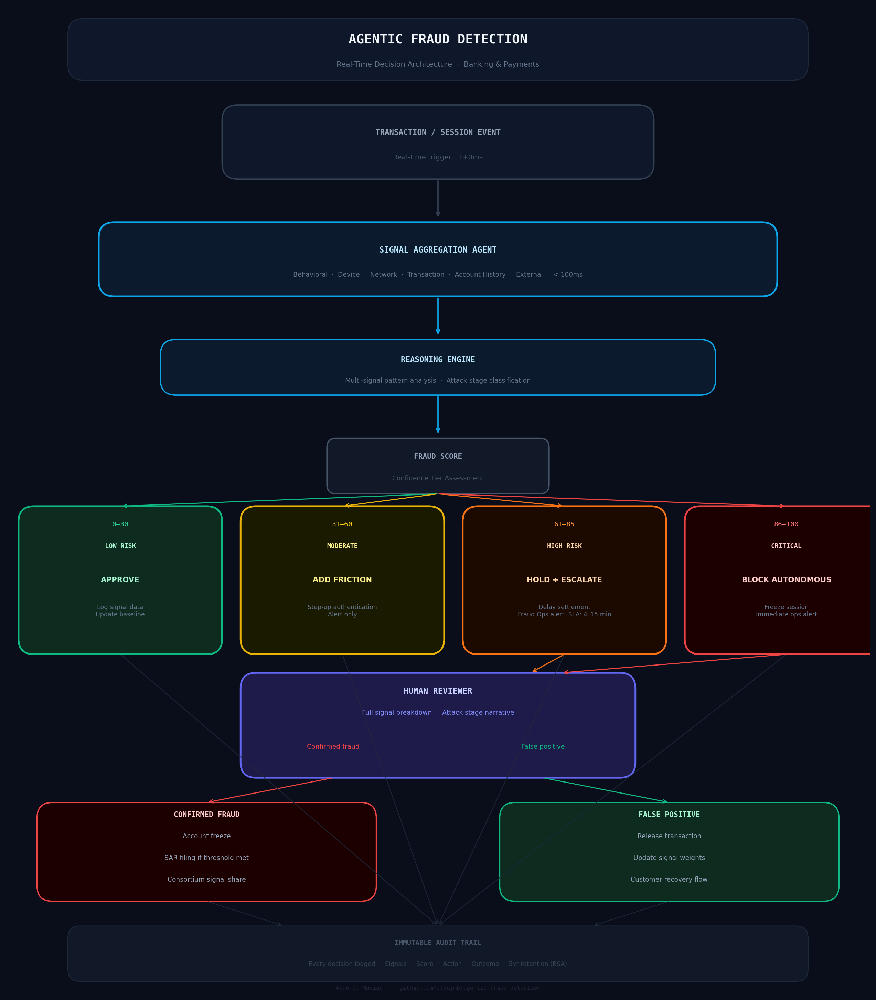

# Agentic Fraud Detection Patterns

**Architecture patterns for AI agents that detect, investigate, and respond to fraud in real-time banking and payments environments.**

> *Traditional fraud detection systems answer one question: is this transaction anomalous? Agentic fraud detection answers a harder question: what should happen next — and who should decide?*

---

## The Problem With Current Fraud Detection

Most enterprise fraud detection in banking today is a pipeline, not an agent.

A transaction is scored. A threshold is crossed. A rule fires. A case is created. A human reviews it — hours or days later.

This architecture was designed for a world where fraud happened at human speed. It is failing in a world where:

- Account takeover attacks execute in under 90 seconds
- Synthetic identity fraud builds credit profiles over months before triggering
- Payment fraud in real-time rails (FedNow, RTP) is irreversible once settled
- Fraudsters use AI to probe detection systems and adapt in real time

The response to these threats requires agents — systems that reason about context, coordinate across signals, take actions, and escalate to humans at the right moment with the right information.

This repo documents the architecture patterns that make that possible.

---

## Who This Is For

- **AI Product Managers** designing fraud detection agents for banking and payments
- **Risk & Fraud Engineering teams** building real-time detection systems
- **Enterprise Architects** integrating agentic AI into existing fraud operations
- **Chief Risk Officers** evaluating agentic fraud approaches for regulated environments

---

## Pattern Library

```
┌─────────────────────────────────────────────────────────────────┐
│                    DETECTION LAYER                               │
│   Signal Aggregation · Anomaly Reasoning · Context Retrieval    │
├─────────────────────────────────────────────────────────────────┤
│                    DECISION LAYER                                │
│   Autonomous Action · Human Escalation · Confidence Thresholds  │
├─────────────────────────────────────────────────────────────────┤
│                    RESPONSE LAYER                                │
│   Intervention · Communication · Recovery · Audit Trail         │
└─────────────────────────────────────────────────────────────────┘
```



---

## Part 1 — Detection Layer Patterns

### Pattern 1.1 — Multi-Signal Aggregation Agent

**Problem:** Single-signal fraud detection (velocity rules, device fingerprint, amount thresholds) produces high false positive rates. Each signal alone is insufficient. The fraud pattern lives in the combination.

**Pattern:** A detection agent that aggregates signals across dimensions before scoring:

```
Signals consumed per transaction event:
├── Behavioral signals
│   ├── Session behavior (typing cadence, mouse patterns, navigation flow)
│   ├── Device posture (new device, rooted/jailbroken, emulator detected)
│   └── Authentication anomalies (MFA bypass attempts, credential stuffing indicators)
├── Transaction signals
│   ├── Amount vs historical profile
│   ├── Beneficiary vs known network
│   ├── Channel vs usual pattern
│   └── Time vs behavioral baseline
├── Network signals
│   ├── IP geolocation vs device location
│   ├── IP reputation (proxy, VPN, Tor exit node)
│   └── Device-account association graph
└── External signals
    ├── Consortium fraud feeds (shared industry signals)
    ├── Real-time threat intelligence
    └── Mule account network indicators
```

**Agent reasoning flow:**
1. Collect available signals for the triggering event
2. Retrieve historical baseline for this account/device/beneficiary
3. Score each signal dimension independently
4. Reason about signal combinations — high-confidence fraud requires pattern, not just anomaly
5. Output: fraud probability + signal contribution breakdown + recommended action

**Design mandate:** The agent must be able to explain which signals drove its conclusion. An unexplainable fraud block creates customer friction and is indefensible to regulators.

---

### Pattern 1.2 — Account Takeover Detection Agent

**Problem:** ATO attacks rarely trigger on a single event. The attack unfolds across sessions — credential testing, profile reconnaissance, trust signal manipulation — before the fraudulent transaction occurs.

**Pattern:** A persistent session-aware agent that builds attack narratives across time:

```
ATO Attack Stages → Agent Detection Points:

Stage 1: Credential Testing
└── Agent detects: Login velocity from new IP, failed attempt patterns,
    credential stuffing signatures, password reset abuse

Stage 2: Reconnaissance
└── Agent detects: Unusual balance inquiries, beneficiary list access,
    limit checks without transaction intent, session behavior divergence

Stage 3: Trust Manipulation
└── Agent detects: Contact info changes (email, phone, address),
    MFA method changes, device enrollment from new location,
    security question resets

Stage 4: Pre-positioning
└── Agent detects: New beneficiary addition + immediate transfer,
    limit increase request before large transaction,
    unusual time-of-day activity

Stage 5: Extraction
└── Agent detects: High-value transfer to new beneficiary,
    multiple rapid transfers, crypto exchange destinations,
    P2P payment patterns inconsistent with profile
```

**Agent reasoning flow:**
1. Maintain a rolling risk narrative for each account session
2. Assign risk weight to each stage signal observed
3. Escalate when cumulative stage signals cross threshold — before extraction, not after
4. On escalation: freeze session, trigger step-up authentication, alert fraud ops with narrative

**Design mandate:** ATO detection must act at Stage 3 or Stage 4. Acting at Stage 5 means the money is already moving. Design the agent's escalation thresholds for pre-extraction intervention.

---

### Pattern 1.3 — Real-Time Payments Fraud Agent

**Problem:** Real-time payment rails (FedNow, RTP, Zelle) are irreversible once settled. The fraud detection window is measured in seconds, not hours. Traditional review queues don't apply.

**Pattern:** A sub-second decision agent with hard action authority:

```
Decision timeline for real-time payments:

T+0ms    Payment instruction received
T+50ms   Signal aggregation complete
T+100ms  Agent reasoning complete
T+200ms  Action taken (approve / hold / block)
T+500ms  Settlement window closes (some rails)
```

**Agent action authority at each confidence tier:**

| Confidence | Score | Agent Action | Human Involvement |
|---|---|---|---|
| Low fraud risk | 0–30 | Approve, log | None |
| Moderate risk | 31–60 | Approve with friction (step-up auth) | Alert only |
| High risk | 61–85 | Hold for review, notify customer | Required within SLA |
| Critical risk | 86–100 | Block, freeze session, alert fraud ops | Immediate |

**Design mandate:** At the critical tier, the agent must act autonomously. There is no time for human review. This requires explicit institutional sign-off on the agent's block authority — and a robust false positive recovery process, because blocking a legitimate payment has real customer cost.

---

### Pattern 1.4 — Synthetic Identity Detection Agent

**Problem:** Synthetic identity fraud (SIF) builds a plausible credit identity over months or years before executing a bust-out attack. No single signal is anomalous. The fraud pattern is only visible across the account lifecycle.

**Pattern:** A longitudinal reasoning agent that evaluates identity coherence over time:

```
Synthetic identity indicators the agent monitors:

Identity coherence signals:
├── SSN issued date vs reported age inconsistency
├── Credit file thin/absent for stated age
├── Address history gaps or non-residential addresses
└── Phone/email age vs account opening date

Behavioral coherence signals:
├── Credit utilization pattern atypical for stated profile
├── Payment behavior: minimum payments, never late — artificially clean
├── Limit increase requests disproportionate to utilization
└── No organic product cross-sell engagement

Pre-bust-out signals:
├── Sudden maximum utilization across all credit lines
├── Balance transfer to cash instruments
├── Contact information changes before delinquency
└── Application for additional credit lines simultaneously
```

**Design mandate:** SIF detection agents must operate on account-level longitudinal data, not transaction-level events. The agent needs memory across the account lifecycle, not just the current session.

---

## Part 2 — Decision Layer Patterns

### Pattern 2.1 — Confidence-Tiered Escalation

The most consequential design decision in a fraud agent is not how it detects fraud — it is how it decides what to do about it.

**The core tension:** False negatives cost the bank. False positives cost the customer relationship.

A fraud agent that blocks every high-risk transaction protects against loss but destroys the customer experience. A fraud agent that approves everything to avoid friction enables fraud. The calibration between these outcomes is a product decision, not an engineering decision.

**Escalation design principles:**

1. **Reversibility determines autonomy.** The agent can act autonomously on reversible decisions. Irreversible decisions (blocking a real-time payment, freezing an account) require higher confidence thresholds or human confirmation.

2. **Customer communication is part of the decision.** A blocked transaction with no explanation creates abandonment and calls. A blocked transaction with a clear step-up authentication request creates a security signal that customers respect.

3. **Escalation quality matters more than escalation volume.** A fraud ops team flooded with low-confidence cases cannot effectively work high-confidence ones. The agent must triage, not just escalate.

**Escalation packet — what the agent sends to human reviewers:**

```yaml
case_id: FRD-2025-XXXXXX
triggered_by: Pattern 1.2 — ATO Stage 4 signal accumulation
account_id: [anonymized]
risk_score: 78
confidence: high
recommended_action: hold_and_step_up

signal_summary:
  - New device enrolled from foreign IP (weight: 0.35)
  - Beneficiary added 4 minutes before transfer attempt (weight: 0.28)
  - Transfer amount: 340% above 90-day average (weight: 0.22)
  - Session behavior divergence from baseline (weight: 0.15)

attack_stage: Stage 4 — Pre-positioning
narrative: >
  Account shows Stage 3-4 ATO indicators. New device enrolled from
  IP geolocated to Eastern Europe at 02:14 AM local time. Beneficiary
  added immediately prior to transfer attempt. Amount significantly
  exceeds customer profile. Recommend step-up authentication before
  any action. If step-up fails, recommend session freeze.

customer_impact_if_blocked: Medium — legitimate transaction possible
customer_impact_if_approved: High — likely fraud loss if ATO confirmed
sla: 4 minutes (real-time rail settlement window)
```

---

### Pattern 2.2 — False Positive Recovery

Every fraud agent will block legitimate transactions. How the product handles that moment determines whether customers stay or leave.

**Recovery design requirements:**

- Customer must be notified immediately via their preferred channel
- Recovery path must be frictionless — step-up auth, not a call center
- Recovery must be available 24/7 — fraud doesn't respect business hours
- Agent must update its model from confirmed false positives — the block should not repeat

**False positive feedback loop:**

```
Block → Customer notification → Recovery attempt
                                      ↓
                          Customer authenticates → Transaction released
                                      ↓
                          False positive confirmed → Signal weight adjustment
                                      ↓
                          Account profile updated → Threshold recalibrated
```

---

## Part 3 — Response Layer Patterns

### Pattern 3.1 — Autonomous Response Actions

Actions the fraud agent can take without human approval, by risk tier:

| Action | Condition | Reversible? |
|---|---|---|
| Add friction (step-up auth) | Moderate risk signal | Yes |
| Delay settlement | High risk, real-time rail | Yes (within window) |
| Notify customer | Any fraud signal | Yes |
| Block single transaction | High confidence fraud | Partially |
| Freeze account | Critical risk, ATO confirmed | No — requires human to lift |
| File SAR | Regulatory threshold met | No |

**Design mandate:** Account freeze and SAR filing must have human confirmation in the loop. These are irreversible actions with regulatory and customer relationship consequences.

---

### Pattern 3.2 — Audit Trail Requirements

Every fraud agent action must be auditable. This is not a compliance nicety — it is operationally necessary for dispute resolution, regulatory examination, and model improvement.

**Minimum audit record per agent decision:**

```
- Timestamp (millisecond precision)
- Account / session identifier
- Triggering event
- Signals evaluated (with weights)
- Reasoning trace (summarized)
- Confidence score
- Action taken
- Human reviewer ID (if escalated)
- Outcome (confirmed fraud / false positive / inconclusive)
- Customer impact
```

Audit records must be immutable, retained per regulatory requirements (minimum 5 years for BSA/AML-related decisions), and accessible to compliance and legal teams without requiring engineering involvement.

---

## Templates

| Template | Purpose |
|---|---|
| [signal-inventory-template.md](templates/signal-inventory-template.md) | Map available signals before agent design |
| [escalation-packet-template.yaml](templates/escalation-packet-template.yaml) | Standard format for human escalation |
| [false-positive-review-template.md](templates/false-positive-review-template.md) | Document and learn from false positives |
| [agent-action-authority-template.md](templates/agent-action-authority-template.md) | Define autonomous action boundaries |

---

## Regulatory Considerations

| Requirement | Implication for Fraud Agents |
|---|---|
| BSA / AML | Agent decisions that meet SAR thresholds must be logged and reported — autonomous filing requires legal review |
| FCRA | Adverse actions based on fraud scoring must be explainable to customers |
| Regulation E | Customer dispute rights apply even when fraud agent blocked a transaction — recovery path is mandatory |
| OCC Model Risk (SR 11-7) | Fraud agents are models — they require validation, documentation, and ongoing performance monitoring |
| CFPB UDAAP | Fraud friction applied disproportionately to protected classes is an enforcement risk |

---

## Origin

These patterns were developed from direct experience building and deploying AI-powered fraud and risk systems in regulated financial environments, including a transactional banking assistant serving **20M+ users** and processing 28K+ secure operations per month.

---

## Related Frameworks

- [Financial Agent Guardrails Playbook](https://github.com/aldojmb/financial-agent-guardrails) — designing, implementing, and auditing guardrails in banking AI agents
- [Delegation Ladder](https://github.com/aldojmb/delegation-ladder) — designing AI agents that earn trust progressively
- [Agent Factory Framework](https://github.com/aldojmb/agent-factory-framework) — end-to-end delivery framework for enterprise AI agents

---

## Author

**Aldo J. Macías** — Principal AI Product Leader

- LinkedIn: [linkedin.com/in/aldojmacias](https://linkedin.com/in/aldojmacias)
- Portfolio: [aldojm.com](https://aldojm.com)

---

## Citation

```
Macías, Aldo J. (2025). Agentic Fraud Detection Patterns: Architecture patterns
for AI agents that detect, investigate, and respond to fraud in real-time
banking and payments environments.
https://github.com/aldojmb/agentic-fraud-detection
```

---

## License

[MIT](LICENSE) — use freely, attribution appreciated.
